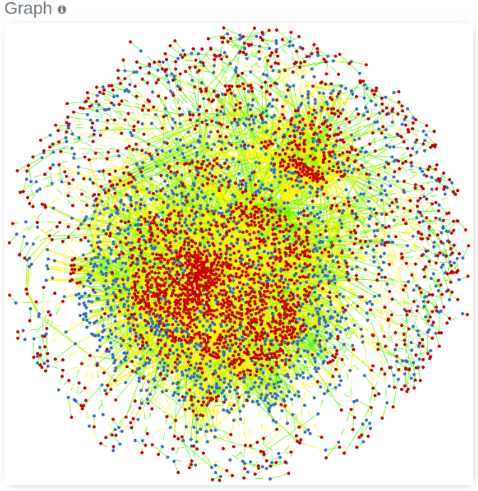

#Web Pipeline for Flux Balance Analysis

The project is based upon Flux Balance Analysis, which is a model used for simulating metabolism. It is used in genome-scale reconstructions of metabolic networks. This project aims at building a web-based pipeline which will help in analysis. The user will be able to submit an SBML model, a representation format based on XML helping in the biological process, select one of the analysis methods and in turn, get a result that will be produced after passing the input through the pipeline. The pipeline will send the input to the COBRAPy microservice, which will return the result through node.js express routes and the results will be displayed via ReactJS frontend.

